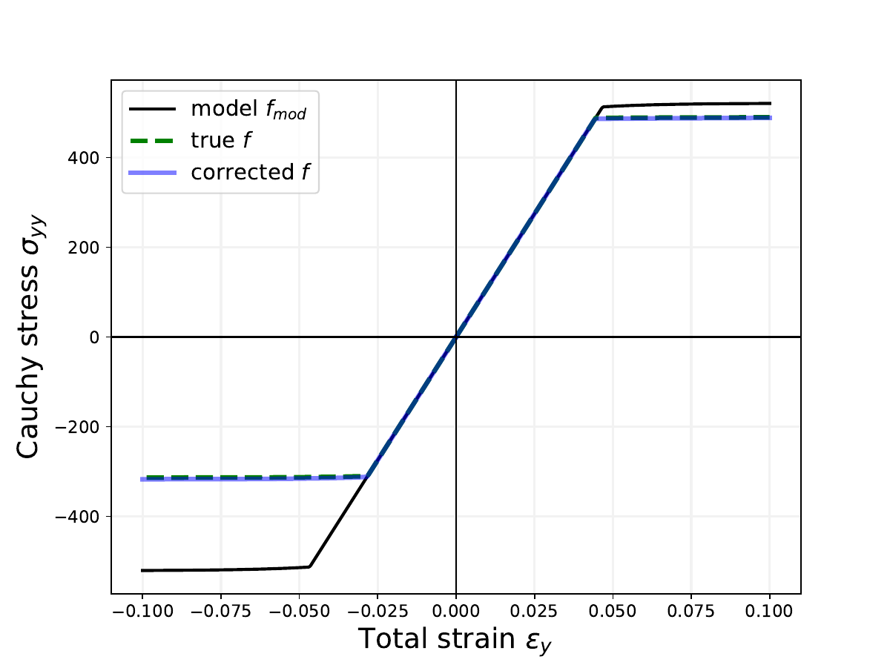
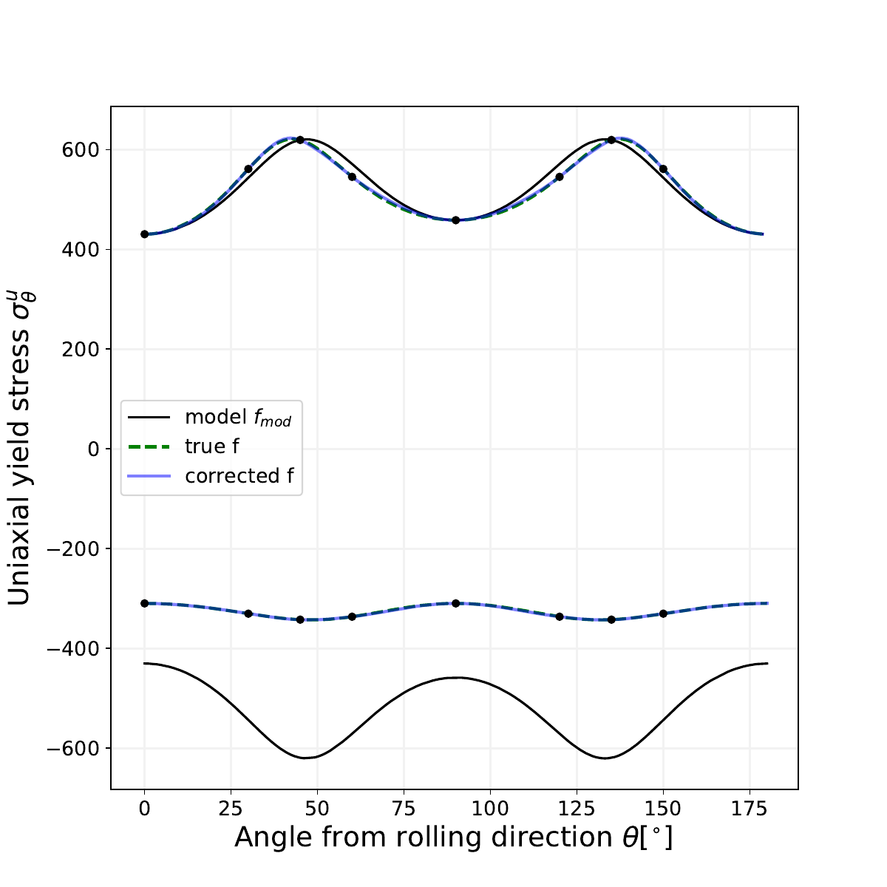
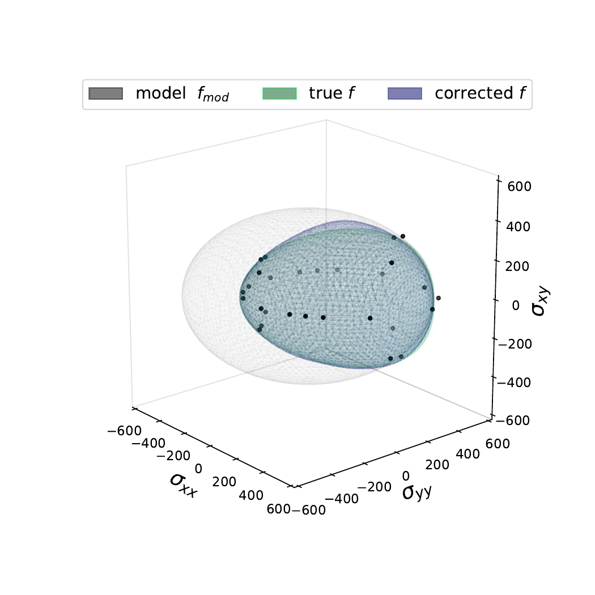

## Model-data-driven modeling of yield functions

  - Author: Jan N Fuhg
  - Organization: Cornell University


<p align="center">
 </p>
 

</p> 

<table>
  <tr>
    <td>Stress-strain curve</td>
     <td>Uniaxial loading comparison</td>
     <td>Yield surfaces in 3D space</td>
  </tr>
  <tr>
    <td> </td>
    <td> </td>
    <td> </td>
  </tr>
 </table>


## Installation
This code requires an [Anaconda](https://www.anaconda.com/products/individual) or [Miniconda](https://docs.conda.io/en/latest/miniconda.html) environment with a recent Python version.
The complete repository can be cloned and installed locally. It is recommended to create a conda environment before installation. This can be done by the following the command line instructions

```
$ git clone https://github.com/FuhgJan/modelDataDriven_YieldFunction.git ./modelDataDriven_YieldFunction
$ cd modelDataDriven_YieldFunction
$ conda env create -f environment.yml
$ conda activate modelDataDriven_YieldFunction
$ python -m pip install . --user

```
The code can then be run with

```
$ python -m mDataDriven
```

Outputs will be written to mDataDriven/Images/.


## Dependencies

The code requires the following packages as imports:

 - [NumPy](http://numpy.scipy.org) for array handling
 - [Scipy](https://www.scipy.org/) for numerical solutions
 - [pytorch](https://pytorch.org/) for the neural network and automatic differentiation libraries
 - [MatPlotLib](https://matplotlib.org/) for graphical output
 - [sympy](https://www.sympy.org/en/index.html) for some symbolic algorithms
 - [scikit-image](https://scikit-image.org/) for marching cubes algorithm
 - [https://scikit-learn.org/stable/](https://scikit-learn.org/stable/) for predefined scaler classes


## References
If you use part of this code consider citing:

[1] Fuhg, Jan Niklas, et al. "Elasto-plasticity with convex model-data-driven yield functions." (2022).


## License

This package comes with ABSOLUTELY NO WARRANTY. This is free
software, and you are welcome to redistribute it under the conditions of
the GNU General Public License
([GPLv3](http://www.fsf.org/licensing/licenses/gpl.html))

The contents are published under the 
Creative Commons Attribution-NonCommercial-ShareAlike 4.0 International License
([CC BY-NC-SA 4.0](http://creativecommons.org/licenses/by-nc-sa/4.0/))
